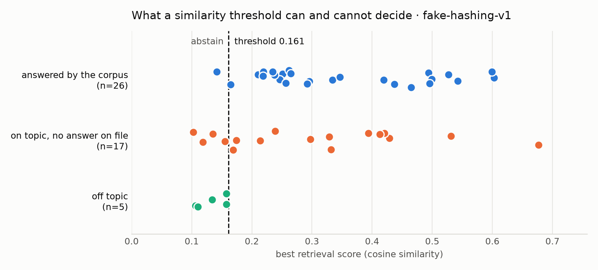

# Retrieval calibration -- `fake-hashing-v1`

_Generated 2026-09-22 by `make calibrate`. 61 chunks, top-k = 4, a wrong answer counted 3x a needless abstention._

**Abstention threshold: `0.161`** -- fitted on the calibration
split alone, against off-topic questions. The holdout split had no say in it,
so those are the numbers worth quoting.

## What the threshold decides

| split | questions | answers when the corpus answers | rejects off-topic | hit@k |
|---|---|---|---|---|
| calibration | 32 | 94% (18) | 100% (3) | 83% |
| holdout | 16 | 100% (8) | 100% (2) | 75% |

`hit@k` is retrieval quality and has nothing to do with the threshold: it asks
whether the document that answers the question was among the passages retrieved
at all. A low hit@k is a chunking or corpus problem; a low answer rate with a
high hit@k is a threshold problem.

## What it cannot decide, and who does

| split | on-topic questions with no answer on file | stopped by the threshold |
|---|---|---|
| calibration | 11 | 18% |
| holdout | 6 | 33% |

Cosine similarity scores *topic*, not answerhood. "How much is the missed
appointment fee" retrieves the section headed "Missed Appointments" -- correctly,
at one of the highest scores in the whole set -- and that section does not state
a fee. To the geometry it is indistinguishable from a question the corpus does
answer, so no threshold separates the two, and raising the threshold until it
does only means refusing real questions.

That residual is not swept under the rug; it is the measured size of the job
the next layer has to do. Phase 4's agent reads the passage, sets
`sufficient=False`, and a deterministic citation check turns that into an
abstention plus a `KB_GAP` record -- which doubles as the list of documents
this clinic should write. Every question in this class is one of them.

## By question type (all splits)

| kind | answered by corpus | n | median score | max score | stopped by threshold |
|---|---|---|---|---|---|
| direct | yes | 12 | 0.495 | 0.603 | 0/12 refused |
| paraphrase | yes | 10 | 0.247 | 0.346 | 1/10 refused |
| multi_hop | yes | 4 | 0.327 | 0.465 | 0/4 refused |
| near_miss | no | 12 | 0.315 | 0.677 | 3/12 |
| structured | no | 5 | 0.174 | 0.394 | 1/5 |
| off_topic | no | 5 | 0.134 | 0.158 | 5/5 |

## Off-topic questions that got through

None, in either split. Off-topic questions score far below anything the corpus covers, which is exactly the separation the threshold is there to enforce.
